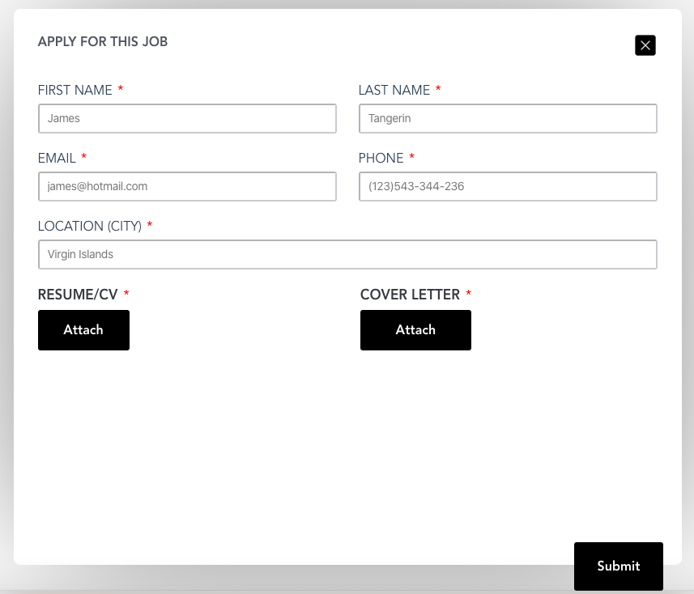
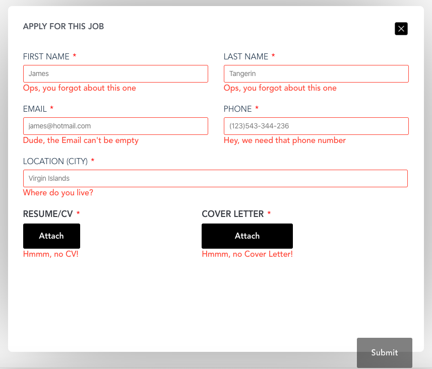

# job-application-form

## Technologies Used
1. Vuejs Framework 
2. SASS preprocessor 
3. PUG template engine 
4. TypeScript
5. MirageJs (for mocking API calls)
6. Sweet alert (for success messages)

## Additional features
- Media queries to make the for more responsive 
- Animation & transition for the form
- Axios request with mock server to test the payload 
- files upload & attachments (resume & cover letter files)

## Project setup
```
npm install
```

### Compiles and hot-reloads for development
```
npm run serve
```

### Compiles and minifies for production
```
npm run build
```

### Run your tests
```
npm run test
```

### Lints and fixes files
```
npm run lint
```

### Customize configuration
See [Configuration Reference](https://cli.vuejs.org/config/).


